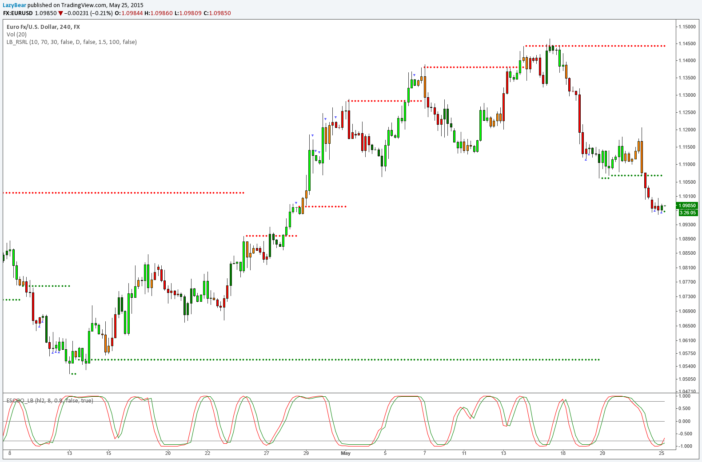
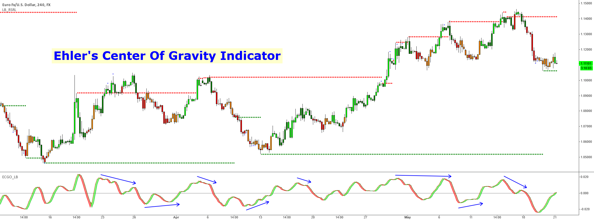

# Ehlers-Stochastic-Oscillator

TradingView Stochastic Indicator Script

## [Ehlers Stochastic Oscillator [LazyBear]](https://kr.tradingview.com/script/aX0yTFaA-Ehlers-Stochastic-CG-Oscillator-LazyBear/)

Another one from [Ehlers](https://kr.tradingview.com/scripts/fishertransform/).

[Ehlers](https://kr.tradingview.com/scripts/fishertransform/) likes the idea behind StochRSI so much, he dedicated a full chapter in his book (linked below)
on how [stoch](https://kr.tradingview.com/scripts/stochastic/) works with his "superlative" (his words, not mine) indicators.
This is [stoch](https://kr.tradingview.com/scripts/stochastic/) of his [CG](https://kr.tradingview.com/symbols/NASDAQ-CG/) oscillator.

Standard [stochastic](https://kr.tradingview.com/scripts/stochastic/) oscillator uses fixed period for calculations and does not adjust to the constantly changing market cycle length.
[Stochastic](https://kr.tradingview.com/scripts/stochastic/) [CG](https://kr.tradingview.com/symbols/NASDAQ-CG/) Oscillator does not have such a drawback.

Use this like normal stochRSI osc (Uncheck "Fill Osc/Trigger" option, sample chart below)

More info:
- [CG](https://kr.tradingview.com/symbols/NASDAQ-CG/) oscillator:

- Cybernetic Analysis for Stocks and [Futures](https://kr.tradingview.com/scripts/commodities/) ( [Ehlers](https://kr.tradingview.com/scripts/fishertransform/) )

## Reference
- [List of LazyBear public indicators](http://bit.ly/1LQaPK8)
- [List of LazyBear app-store indicators](http://blog.tradingview.com/?p=970)
